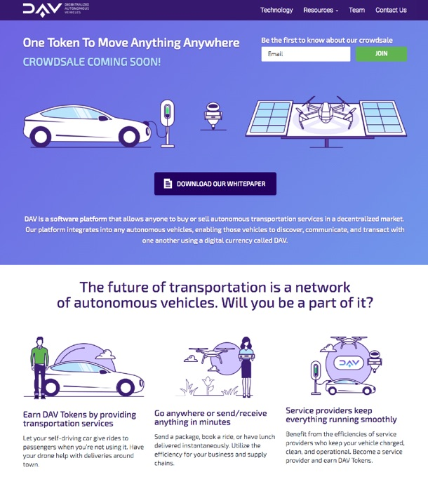

# DAV Website

The first stop for most people discovering DAV for the first time, our website serves to introduce the idea, our team, and serve as the gateway in the journey to discover more about DAV.

Visit us at https://dav.network/

## Get started

1. Clone this repo `git clone git@github.com:DAVFoundation/davfoundation.github.io.git`
2. Install `npm i node-sass && npm i uglifyjs` 
3. Run `make build` to compile SCSS to CSS and Uglify your JS